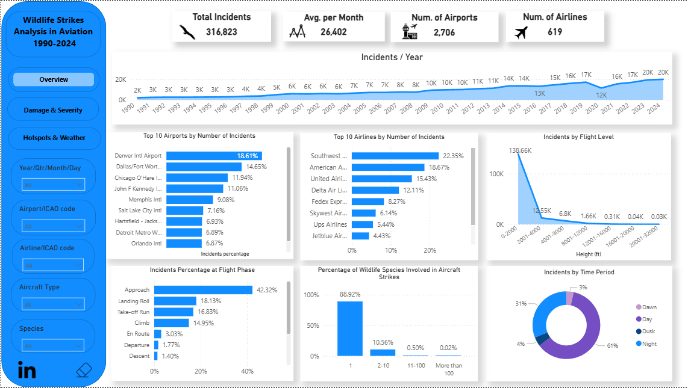
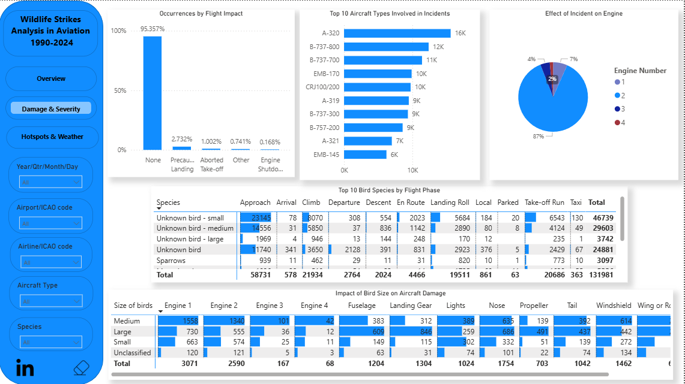
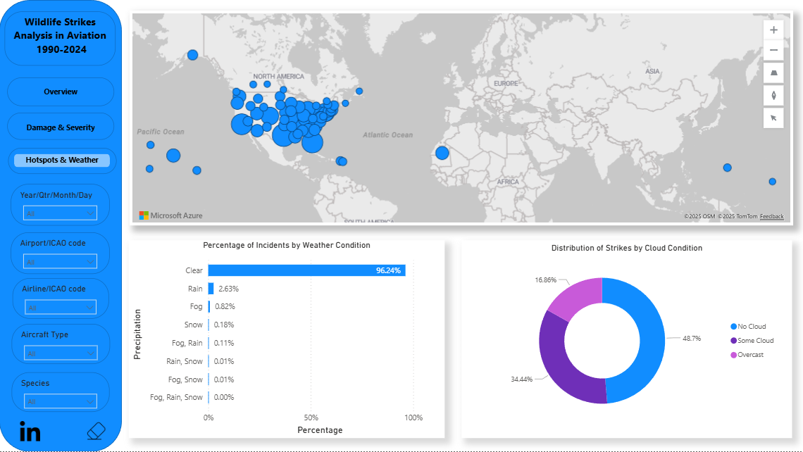

# ✈️ Aviation Wildlife Strikes Analysis (1990–2024).
## Aviation Wildlife Strikes Analysis from 1990 to 2024 Using Power Bi.
## Power BI Dashboard.

## 📌 Project Overview
### Last time, I shared an Excel dashboard that covered wildlife strike incidents from 1990 to 2015. I’ve now taken it a step further and rebuilt the whole analysis in Power BI, expanding the data all the way to 2024—more than 316k incidents in total. 
## In this updated version, I wanted to make the story clearer and the insights easier to explore. The dashboard now shows:
 -  How wildlife strikes have changed over the years.
 -  The airports and airlines that report the most cases.
 -  The flight phases where strikes happen most often.
 -  Which species and bird sizes are involved.
 -  A global map highlighting the hotspots.
 -  Weather and cloud conditions during incidents.
## This update gives a much richer view of the data and helps show where the real risks are in aviation.

## Dashboard 1

## Dashboard 2

## Dashboard 3

# Power BI Dashboard.

